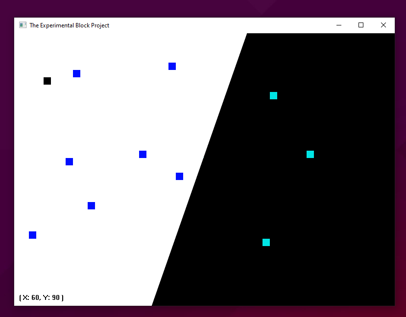

# The Experimental Block Project

> An exploration of the Windows API and the principles of lower level development.

Internal Codename: `blok`.

## Compiling

This project contains a Makefile to for easy compilation - simply run `make` or `mingw32-make` depending on your environment.

This is Compiled using LLVM Clang, if you prefer you can change the `CC` variable in the file to GCC, which should work.

The libraries required are: kernel32, user32, shell32, gdi32.

## Execution and Usage

```txt
# Running the application [args optional]
blok.exe [theme]

# For light mode
blok.exe --light-theme

# For dark mode
blok.exe --dark-theme
```

The program can be executed using the `blok.exe` output in the bin folder.

You can specify the theme (light or dark) when running the program via command line arguments, this is not required. Dark mode is the default.

When the application has been lauched, there will be a graphical window, displaying a
square that can be move around with arrows keys. The position coordinates relative to the
window displayed in the bottom left.

The cursor can be used to mark regions within the window. This is displayed in a colourful
colour.



## Program Structure

| Folder | Description |
|--------|-------------|
| core   | global macros and storage for the program's entrypoint arguments.  |
| model  | contains structures and enumerations to model objects. |
| logic | a translation layer that handles logic and storage for the presentation |
| ui | handles the graphical user interface |

## Changelog (this version: 2401)

* Changed colour scheme.
* Dark mode is now default.
* Continued vector implementation.
* Collusion system with marks.
* Boundary system has been added.
* Safety checks _(not 100% fool-proof)_
* Result macros converted to enum.
* Data types have the convention of prefixed with 'T'.

## Limitations and Known Issues

* Regions cannot be unmarked.
* GDI32 Graphics can flicker.
