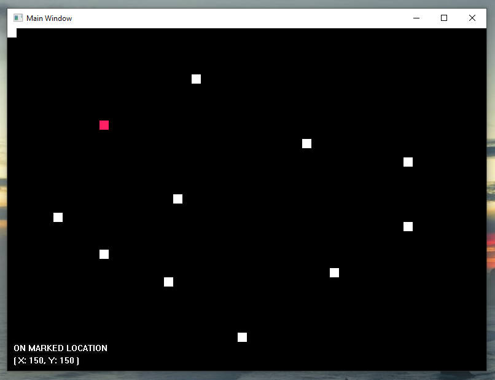

# The Blok Experiment

> A project to explore how native Windows applications are created using the WIN32 API.


## Description

When launching the application, a black painted window is created with a pink block at the top left corner. Towards the bottom left, there is text showing the X and Y coordinates of the pink square; in addition to whether the block is in a marked location.

The pink block's location can be changed or manipulated through the use of arrow keys from the keyboard, also updating the coordinates at the bottom.

The mouse pointer can be used to mark points on the grid; this is indicated by a white block. It can be unmarked by clicking in the same area.




## Compilation and Execution

You can compile in two ways:

Compiling directly with GCC:
```shell
gcc -O3 src/main.c src/app.c src/globals.c src/block.c src/grid.c src/window.c src/window_events.c src/actions.c -o bin/blok -lgdi32
```

Compiling via Mingw's Make
```shell
mingw32-make RELEASE
```

## Wine

Despite this having this application developed with Windows NT in mind, the compiled executable can work under wine. Please ensure that gdi32 library is available if you choose to do this.


## Disclaimer

Caution: This application may be potentially memory unsafe. By choosing to compile and run this application, you are aware of this fact.