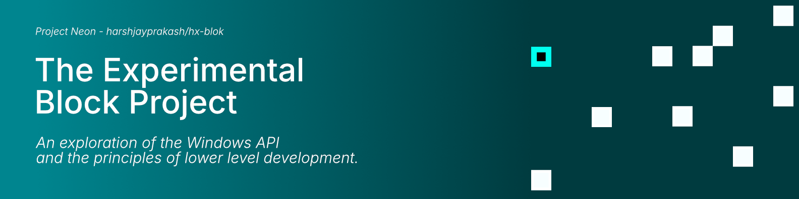
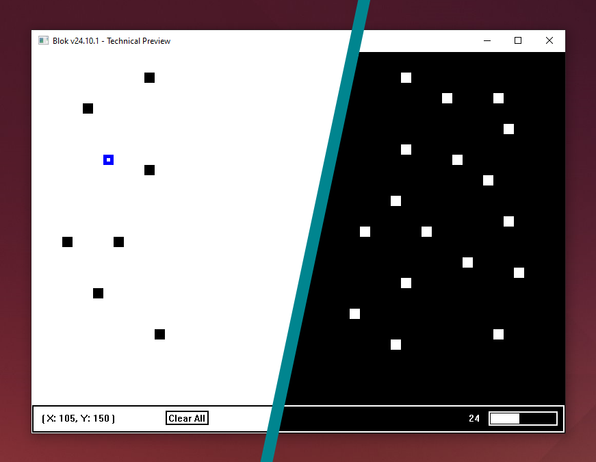

# The Experimental Block Project



> [!NOTE]
> As this is an experiment without a clear roadmap, this program will likely always be in
> the developing stage. There will not be a deployed executable file.

## Usage



| Ref. | Description |
|:----------|:------------|
| 1 | This refers to the canvas component, where most of the interaction will take place. |
| 2 | An "Obstructable", a sort of wall for the "Block". This can be added by clicking on the canvas with the mouse. |
| 3 | The "Block" (the main part or component) is a coloured square (blue in light mode, aqua in dark mode) that can be moved by the arrow keys and cannot move past the "Obstructables". |
| 4 | The Panel component, which shows information and additional actions. |
| 5 | Shows the coordinates of the "Block". |
| 6 | A button to clear all the "Obstructables". |
| 7 | Shows the number of "Obstructables" that have been created. |
| 8 | Shows the internal vector capacity. |
| 9 | The native window title. |

## Compilation and Execution

This program uses the make build system. Note, this uses the clang compiler, you can
switch it to the GCC compiler, if you wish by changing the CC variable in the makefile.
You can run the following:

```sh
# Creating the folders for the compilation process.
mingw32-make init

# Building and linking the program.
mingw32-make build

# Running the program. 
# Optional arguments "--light-mode" or "--dark-mode".
# Default is dark mode.
./bin/neon-blok
```

## What's New (Version 24.10)

- Logging
- Re-implementated Result System
- Vector Size Indicator
- Changed Style of Movable Block
- Switched Colour Scheme

## Code Standard

The codename for this project is "Neon", so structures, enumerations and functions are
prefixed with this. These are in PascalCase, while variables are in camelCase.

## Known Issues and Limitations

- GDI32 Graphics flicker

## Find an issue

If you find an issue, feel free to report it under the issues tab of this repository.
